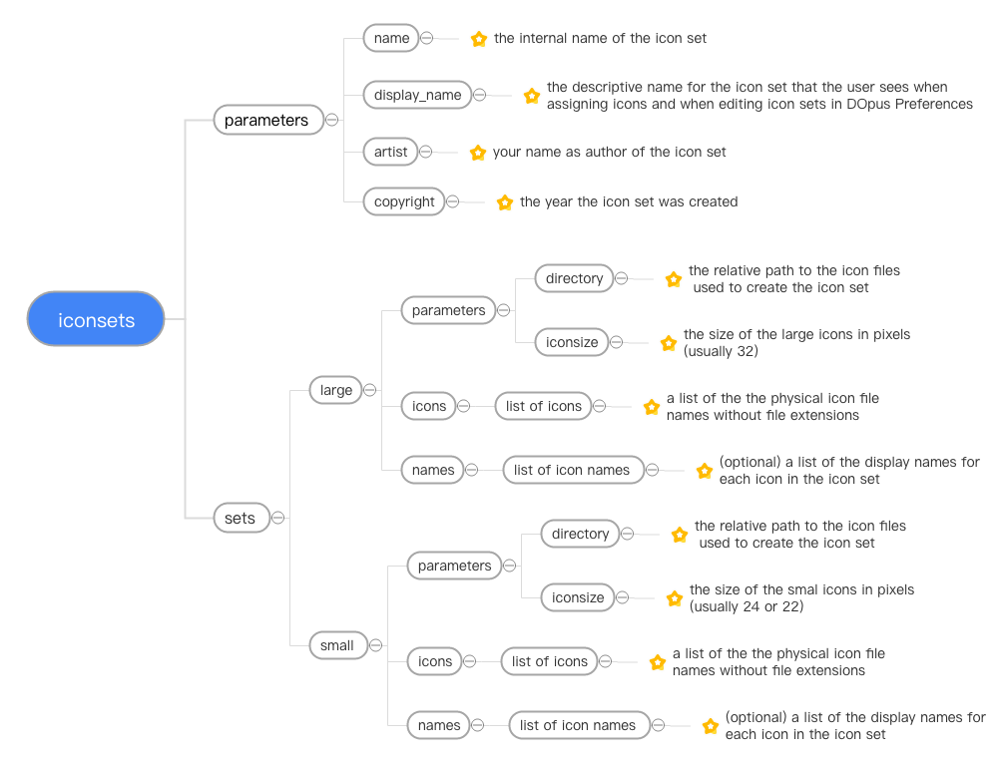

# Directory Opus Icon Set Builder

This app automates the process of building a custom Directory Opus iconset. The input to the script is a configuration file in either `JSON` or `YAML` format, accompanied by a set of "large"icon image files and another set of "small" icon image files as used by Directory Opus. The large and small icon Images are typically sized to 32 and 24 pixels respectively. The output from the script is a `.dis iconset bundle` that is loaded into Directory Opus via `Preferences->Toolbars->Icons`. In addition to creating the iconset .dis bundle, the script can also generate all the intermediate files that make up that bundle, resize disparate icons to make them compatible with DOpus, add padding to icons and more.

At its core, this app is a Python script `IconSetBuilder.py`that is invoked by running `IconSetBuilder.cmd`which sets up the Python environment and passes on the relavent command line arguments. See below for usage details.

To get things up and running, run` setup.cmd` from a command prompt. This will setup the Python environment and all the necessary python dependencies automatically so you don't need to deal with those details. The only thing you need to do beforehand is install a suitable Python 3 distribution. Fortunately, Microsoft made that easy, as you can install Python 3 directly from the [Microsoft Store](https://www.microsoft.com/en-us/p/python-39/9p7qfqmjrfp7?activetab=pivot:overviewtab).

In order to understand how this app works and what you can do with it, read through the docs and review the included example content which can be used as a guide and template for creating your own configuration.

## Requirements

|          Requirement          | Description                                                  |
| :---------------------------: | ------------------------------------------------------------ |
|           Python 3            | If you don't already have Python 3 installed on your system, you can install`Python v.3.9` from the [Microsoft Store](https://www.microsoft.com/en-us/p/python-39/9p7qfqmjrfp7?activetab=pivot:overviewtab). If you already have python installed, make sure to upgrade to Python v.3.9 or higher either from the Microsoft Store or the [Official Python website](https://www.python.org/downloads/windows/). Make sure that you are not running Python 2 as this will cause things to fail. You can verify your Python version by running `python --version`. |
| Python Package   Dependencies | Required Python package dependencies are handled automatically by this app. When you run `setup.cmd`, the batch file creates a local Python 3 environment and installs the necessary package dependencies. When you run `IconSetBuilder.cmd` to create an icon set, the batch file loads that local Python environment and executes the script within it. You do not have to deal with manually setting up anything Python related. |

## Input and Output Files

#### Input

- **Iconset configuration file:** You will need to create a configuration file for your icon set in either `JSON` or `YAML` format. Use the provided example `iconset.json` and `iconsetcfg.yaml` files located in the example folder as templates. Note that YAML has some formatting requirements that are listed in the `Caveats` section below. See the following section on creating an Icon Set Configuration file.
- **Icons:** You will need to create a set of icons for both the `large` and `small` sets of icons as used by Directory Opus. These icon files should preferably be in `.png` format, but .jpg, .jpeg and .gif formats will also work. The icons should be sized to `32 and 24 pixels` and located in separate folders. The included example icons are stored in `icons\32 and icons\24` but these names are not cut in stone. The folder names can be whatever you wish, but they should at least hint at the size of the icons. Another possible option might be `icons\large and icons\small`. Review the example icons  and read the additional document `DOpus Default Icon Names.md`in the docs folder for tips on naming icons.

#### Output

**Iconset .dis bundle**: this is simply a `.zip`archive renamed to `.dis`. This is the only output generated by the app unless the `-i / --intfiles` option is supplied. If specified, this option will generate the intermediate files that comprise the .dis bundle. This content is useful in reviewing and verifying your work. Following is a list of this intermediate content which comprises the .dis bundle that is loaded by DOpus:

- Icon set definitions file: [icon set name].xml
- Large icon sheet: [icon set name]-large-iconset.png
- Small icon sheet: [icon set name]-small-iconset.png

<u>Note</u>: the term `icon sheet` refers to a single image containing  a 32 column grid of individual icons. There are two icon sheets, one for DOPus large icons and the other for DOpus small icons The icon set definitions file [icon set name].xml references individual icons in these image sheets by their row x col position in the grid. See the example content for clarification.

## The Icon Set Configuration File

Both JSON and YAML configuration file formats are supported by this app. There is no advantage to using one format over the other so the choice is strictly a personal preference. In either case, the required sections and parameters for the configuration file are shown below.



## Installation and Configuration

Note: the following installation instructions are also defined in the `INSTALL.md` file that is part of this release.

1. **IMPORTANT - Install Python 3 first:** This app is a python script at heart so Python 3 must be installed. Fortunately, Microsoft makes this easy, as you can install Python 3 directly from the [Microsoft Store](https://www.microsoft.com/en-us/p/python-39/9p7qfqmjrfp7?activetab=pivot:overviewtab). Or, if you prefer, you can also download the latest Python 3 version from the  [Official Python website](https://www.python.org/downloads/windows/). In either case, make sure you install `Python v.3.9`or later. <u>Do not install or use Python 2 as this will cause things to fail</u>. You can check the Python version by running `python --version`.
2. Unzip `IconSetBuilder.zip`
3. Run the enclosed`setup.cmd`from a command prompt which configures Python for the app. This is a one time operation and you can safely remove setup.cmd once the configuration is complete.
4. Test the app by generating some example content: from a command prompt, run `IconSetBuilder.cmd -i example\iconsetcfg.json`. This will generate the example iconset bundle named `X-Qute Test IconSet (JSON).dis` and the intermediate .png and .xml files that comprise that bundle. Review the example\iconsetcfg.json configuration file and the output.
5. Read the docs:`INSTALL.md`,`README.md` and`Default Icon Names.md`in the doc folder  for app details and  usage instructions.

## Creating an Icon Set

1. Create your own content for building an iconset using the example configuration files and sample icons as a guide:
   - <u>Configuration file</u>: use the provided example configuration files `iconsetcfg.json` and `iconsetcfg.yaml`as templates for creating your own setup. The icon `names` section is optional as icon names can be generated automatically from the icon file names. See the `Icon Names` section below for details.
   - <u>Icons</u>: Create a set of large and small icons, each in their own subfolder (eg. icons\large and icons\small or icons\32 and icons\24). The preferred file format is `png` and the preferred icon sizes are `32 pixels` and `24 pixels`  for the large and small icon sets respectively.
2. Review the `Usage` section below and run the `IconSetBuilder.cmd` script to create your iconset `.dis bundle`.
3. Open Directory Opus Preferences, navigate to the `Toolbars->Icons` section and select `Import` to install your iconset (see below).


## Usage

`IconSetBuilder.cmd [-h] [-i] [-r] [-m <margin>] [-p <padding>] [-f] configfile`

Minimal usage: `IconSetBuilder.cmd <configfile>`

| Short Arguments | Full Arguments       | Description                                                  |
| --------------- | -------------------- | ------------------------------------------------------------ |
| ...             | `<configfile>`       | icon set configuration file (JSON or YAML)                   |
| `-f`            | `--deficons`         | include default empty and spacer icons                       |
| `-i`            | `-intfiles`          | generate intermediate files used to build the ".dis" bundle. This option<br /> is useful for verifying the content of the ".dis" bundle |
| `-r`            | `--resize`           | resize icons to the default values specified in the `iconsize` parameter<br />in the configuration file |
| `-m <pixels>`   | `--margin <pixels>`  | icon sheet margin size in pixels (default =0 )               |
| `-p <pixels>`   | `--padding <pixels>` | icon padding in pixels (default = 0)                         |
| `-h`            | `--help`             | show usage information and exit                              |

## Examples

Following are some example usage scenarios:

```
IconSetBuilder.cmd configfile.json
```

- Basic usage: creates an icon set .dis bundle based on the provided configuration file

```
IconSetBuilder.cmd -i configfile.json
```

- Creates an icon set .dis bundle along with the intermediate bundled content. The intermediate files are useful for verifying the icon set without having to extract the .dis file.

```
IconSetBuilder.cmd -f configfile.json
```

- Creates an icon set .dis bundle that includes the empty and spacer icons that are part of a standard DOpus icon set

```
IconSetBuilder.cmd -i -f configfile.json
```

- Creates an icon set .dis bundle with intermediate content that also includes the empty and spacer icons

```
IconSetBuilder.cmd -r configfile.json
```

- Resizes icons to default values for the large and small icon sets; typically 32 and 24 pixels respectively. This option should be used when you are working with icons of varied sizes that need to normalized to those defaults.

```
IconSetBuilder.cmd -m 8 configfile.json
```

- Creates an icon set .dis bundle with an icon sheet image margin of 8 pixels

```
IconSetBuilder.cmd -p 2 configfile.json
```

- Creates an icon set .dis bundle that adds 2 pixel padding to each icon

```
IconSetBuilder.cmd -h
```

- Displays the usage information for the app

## Icon Names

Names can be assigned to individual icons in one of two ways:

- **Names List (optional)**: include a list of names in the configuration file under the `names` section for each of the large and small icon sets. The `names` list length should match one-to-one with the `icons` list length. If there is a difference between the two, the script will quit with an error.
- **Automatic Naming (default)**: if the `names` section for the large and small sets are not specified in the configuration file, the script will "auto-create" icon names derived from the icon filenames themselves by replacing underscores and dashes with spaces and then applying title-case to the individual words in the name (ex.my-icon-file.png will result in the name My Icon File.)

**Consideration**: you can use whatever names you wish for your icons, but it is worthwhile to consider using the naming convention established for standard DOpus iconsets. This convention does two things: 1) it defines an ordered list of icon names that corresponding to specific DOpus commands and 2) references icons that visually correspond to the meaning of those commands. The order of the names in the list correspond to the row x col position of  icons in the iconset master image grid (icon sheet). If you wish to follow that convention, see `Default Icon Names.md` in the doc folder for details,

## Caveats

- `YAML file format:` Line indentation must use spaces and not tabs. This is a YAML formatting requirement (it does not apply to JSON). If you have inadvertently used tabs or end up with a mix of tabs and spaces, there are quite a few good online converters that will heal your woes. Do a Google search on "spaces tabs online converter". Here's one such converter on [browserling](https://www.browserling.com/tools/tabs-to-spaces).
- `Then why include YAML?` The answer is that YAML format is easier to read than JSON (according to this humble developer)  and, if you follow the remedy to the previous caveat, is easier to create. There are no curly braces and double quotes and commas.

   ## Optional

When executed, `IconSetBuilder.cmd` automatically loads the necessary Python 3 virtual environment required to run the script and unloads that environment upon completion. If you wish to see how things work under the hood, you can manually load the Python environment by executing the batch file `lib\python\Scripts\activate.bat`. Conversely, to unload the Python environment, execute the batch file `lib\python\Scripts\deactivate.bat`. When activated, you can execute python commands within this local virtual environment, review the installed Python packages, add your own packages and edit the Python source code `IconSetBuilder.py` in any way you wish. So that other Directory Opus users can benefit from your work, please contribute your changes through the provided GitHub link.

## GitHub

This project can be found on GitHub at [Directory Opus IconSet Builder](https://github.com/mark-ingenosity/DOpus-IconSetBuilder)

